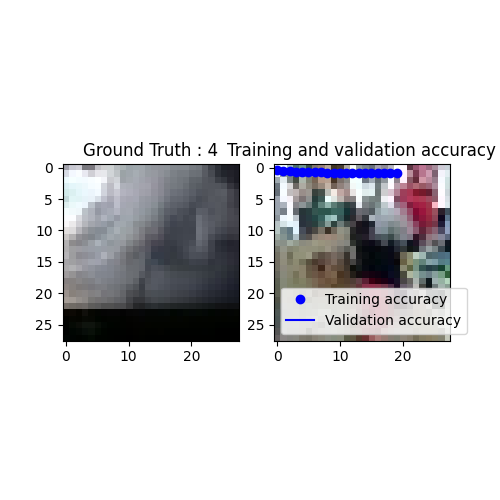
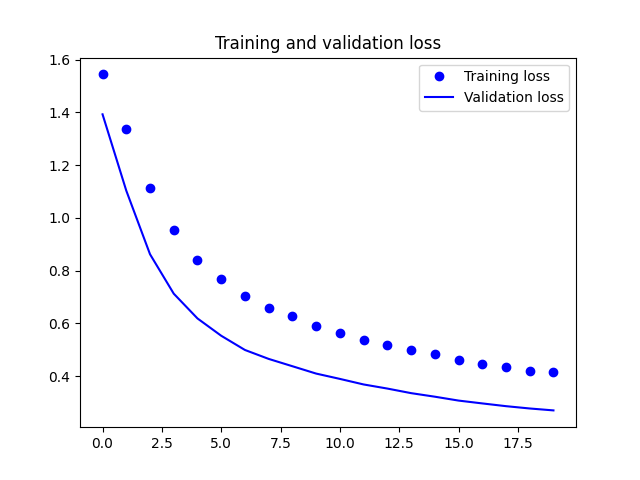

# Documentación del Código de Entrenamiento y Evaluación de Modelo de Clasificación de Catástrofes

## Descripción General

Este proyecto se compone de dos scripts en Python. El primer script (`train_model.py`) es responsable de la carga, preprocesamiento y entrenamiento de un modelo de clasificación de imágenes utilizando una red neuronal convolucional (CNN). El segundo script (`evaluate_model.py`) se encarga de cargar el modelo entrenado, predecir nuevas imágenes y mostrar los resultados.

## `train_model.py`

### Importación de Bibliotecas

```python
import numpy as np
import os
import re
import matplotlib.pyplot as plt
from sklearn.model_selection import train_test_split
from tensorflow.keras.utils import to_categorical
from keras.models import Sequential
from tensorflow.keras.layers import Conv2D, MaxPooling2D, Flatten, Dropout, Dense, LeakyReLU
import keras
import tensorflow as tf
import pickle
```

Se importan las bibliotecas necesarias para el manejo de datos, visualización, preprocesamiento, creación y entrenamiento del modelo de redes neuronales, y guardado de datos.

### Carga y Preprocesamiento de Imágenes

```
dirname = os.path.join(os.getcwd(), 'eventos')
imgpath = dirname + os.sep

images = []
directories = []
dircount = []
prevRoot = ''
cant = 0

print("leyendo imagenes de ", imgpath)

for root, dirnames, filenames in os.walk(imgpath):
    for filename in filenames:
        if re.search("\.(jpg|jpeg|png|bmp|tiff)$", filename):
            cant += 1
            filepath = os.path.join(root, filename)
            image = plt.imread(filepath)
            if len(image.shape) == 3:
                images.append(image)
            print(f"Leyendo...{cant}", end="\r")
            if prevRoot != root:
                print(root, cant)
                prevRoot = root
                directories.append(root)
                dircount.append(cant)
                cant = 0
dircount.append(cant)

dircount = dircount[1:]
dircount[0] += 1
print('Directorios leidos:', len(directories))
print("Imagenes en cada directorio", dircount)
print('Suma total de imagenes en subdirs:', sum(dircount))
```

Esta sección recorre todos los archivos de imagen en el directorio especificado, lee las imágenes y guarda la información de directorios y conteo de imágenes.

### Creación de Etiquetas y Clases

```
labels = []
indice = 0
for cantidad in dircount:
    for i in range(cantidad):
        labels.append(indice)
    indice += 1
print("Cantidad etiquetas creadas: ", len(labels))

eventos = []
indice = 0
for directorio in directories:
    name = directorio.split(os.sep)
    print(indice, name[-1])
    eventos.append(name[-1])
    indice += 1

y = np.array(labels)
X = np.array(images, dtype=np.uint8)
```

Aquí se crean las etiquetas para las imágenes y se guardan los nombres de los eventos.

### Preparación de Datos para Entrenamiento
```
classes = np.unique(y)
nClasses = len(classes)
print('Total number of outputs : ', nClasses)
print('Output classes : ', classes)

train_X, test_X, train_Y, test_Y = train_test_split(X, y, test_size=0.2)
print('Training data shape : ', train_X.shape, train_Y.shape)
print('Testing data shape : ', test_X.shape, test_Y.shape)

train_X = train_X.astype('float32')
test_X = test_X.astype('float32')
train_X /= 255.
test_X /= 255.

train_Y_one_hot = to_categorical(train_Y)
test_Y_one_hot = to_categorical(test_Y)

train_X, valid_X, train_label, valid_label = train_test_split(train_X, train_Y_one_hot, test_size=0.2, random_state=13)
print(train_X.shape, valid_X.shape, train_label.shape, valid_label.shape)
```
<br>

| Layer (type)               | Output Shape      | Param #   |
|----------------------------|-------------------|-----------|
| conv2d (Conv2D)            | (None, 28, 28, 32)|    896    |
| leaky_re_lu (LeakyReLU)    | (None, 28, 28, 32)|      0    |
| max_pooling2d (MaxPooling2D)| (None, 14, 14, 32)|      0    |
| dropout (Dropout)          | (None, 14, 14, 32)|      0    |
| flatten (Flatten)          | (None, 6272)      |      0    |
| dense (Dense)              | (None, 32)        | 200,736   |
| leaky_re_lu_1 (LeakyReLU)  | (None, 32)        |      0    |
| dropout_1 (Dropout)        | (None, 32)        |      0    |
| dense_1 (Dense)            | (None, 5)         |    165    |

Los datos se dividen en conjuntos de entrenamiento y prueba, y se normalizan. Además, las etiquetas se convierten a codificación one-hot.

### Configuración y Construcción del Modelo
```
INIT_LR = 1e-3
epochs = 20
batch_size = 64

evento_model = Sequential()
evento_model.add(Conv2D(32, kernel_size=(3, 3), activation='linear', padding='same', input_shape=(28, 28, 3)))
evento_model.add(LeakyReLU(alpha=0.1))
evento_model.add(MaxPooling2D((2, 2), padding='same'))
evento_model.add(Dropout(0.5))

evento_model.add(Flatten())
evento_model.add(Dense(32, activation='linear'))
evento_model.add(LeakyReLU(alpha=0.1))
evento_model.add(Dropout(0.5))
evento_model.add(Dense(nClasses, activation='softmax'))

evento_model.summary()
```
Se configura y construye la red neuronal convolucional con capas de convolución, pooling, flatten y fully connected.

### Compilación y Entrenamiento del Modelo
```
evento_model.compile(loss=keras.losses.categorical_crossentropy,
                     optimizer=tf.keras.optimizers.SGD(learning_rate=INIT_LR, decay=INIT_LR / 100),
                     metrics=['accuracy'])

evento_train = evento_model.fit(train_X, train_label, batch_size=batch_size, epochs=epochs, verbose=1,
                                validation_data=(valid_X, valid_label))
```

Se compila y entrena el modelo utilizando un optimizador SGD con decaimiento del learning rate.

### Guardado del Modelo y Nombres de Clases

```
evento_model.save("catastrofe.h5")
 
with open('eventos.pkl', 'wb') as f:
    pickle.dump(eventos, f)
```

Se guarda el modelo entrenado y los nombres de las clases en archivos para su uso posterior.

### Evaluación del Modelo

```
test_eval = evento_model.evaluate(test_X, test_Y_one_hot, verbose=1)
print('Test loss:', test_eval[0])
print('Test accuracy:', test_eval[1])
```
Test loss: 0.27774515748023987 <br>
Test accuracy: 0.9250129461288452 <br>
Se evalúa el modelo con el conjunto de prueba y se imprimen los resultados.

### Visualización de la Historia del Entrenamiento

```
accuracy = evento_train.history['accuracy']
val_accuracy = evento_train.history['val_accuracy']
loss = evento_train.history['loss']
val_loss = evento_train.history['val_loss']
epochs_range = range(len(accuracy))

plt.plot(epochs_range, accuracy, 'bo', label='Training accuracy')
plt.plot(epochs_range, val_accuracy, 'b', label='Validation accuracy')
plt.title('Training and validation accuracy')
plt.legend()
plt.figure()
plt.plot(epochs_range, loss, 'bo', label='Training loss')
plt.plot(epochs_range, val_loss, 'b', label='Validation loss')
plt.title('Training and validation loss')
plt.legend()
plt.show()
```
|          | precision | recall | f1-score | support |
|----------|-----------|--------|----------|---------|
| Class 0  |   0.92    |  0.86  |   0.89   |  1390   |
| Class 1  |   0.76    |  0.87  |   0.81   |  1032   |
| Class 2  |   0.99    |  0.99  |   0.99   |  1854   |
| Class 3  |   0.95    |  0.95  |   0.95   |  1763   |
| Class 4  |   0.95    |  0.92  |   0.94   |  1669   |
|----------|-----------|--------|----------|---------|
| accuracy |           |        |   0.93   |  7708   |
| macro avg|   0.91    |  0.92  |   0.91   |  7708   |
| weighted avg | 0.93  |  0.93  |   0.93   |  7708   |


Se visualiza la precisión y la pérdida del entrenamiento y la validación.

## `evaluate_model.py`
### Importación de Bibliotecas
```
import numpy as np
import matplotlib.pyplot as plt
from keras.models import load_model
from skimage.transform import resize
import pickle
```

Se importan las bibliotecas necesarias para la carga del modelo, procesamiento de imágenes y visualización.

### Carga del Modelo y Nombres de Clases

```
evento_model = load_model("sport.h5")

with open('eventos.pkl', 'rb') as f:
    eventos = pickle.load(f)
```

Se carga el modelo entrenado y los nombres de las clases desde los archivos guardados.

### Carga y Preprocesamiento de Nuevas Imágenes

```
images = []
filenames = [
    'test/incendio.jpg',
    'test/inundacion.jpg',
    'test/asalto.jpg',
    'test/tornado.jpg'
]

for filepath in filenames:
    image = plt.imread(filepath)
    image_resized = resize(image, (28, 28), anti_aliasing=True, clip=False, preserve_range=True)
    images.append(image_resized)

X = np.array(images, dtype=np.uint8)
test_X = X.astype('float32')
test_X /= 255.
```

Se cargan nuevas imágenes y se redimensionan y normalizan para que coincidan con el formato esperado por el modelo.

### Predicción y Resultados

```
predicted_classes = evento_model.predict(test_X)

for i, img_tagged in enumerate(predicted_classes):
    predicted_label = np.argmax(img_tagged)
    print(f"{filenames[i]} -> {eventos[predicted_label]}")
```
Se hacen predicciones sobre las nuevas imágenes y se imprimen los nombres de las clases predichas.

### Resultado de las predicciones

test/incendio.jpg -> incendio <br>
 <br>
test/inundacion.jpg -> Floodings <br>
 <br>
test/asalto.jpg -> robo_casa_habitacion <br>
 <br>
test/tornado.jpg -> tornados <br>
 <br>

Como vemos hubo una confusión al quere asociar un asalto ya que lo confundión con un robo casa habitación.
